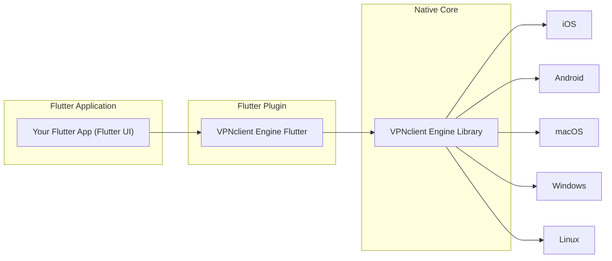

# VPN Client Engine Flutter Plugin

**VPN Client Engine Flutter** is a Flutter plugin that offers a high-level Dart API for managing VPN connections, making it easy to integrate advanced VPN functionality into Flutter apps. It abstracts the complexities of working with different VPN protocols and drivers, providing a unified interface for developers. The plugin supports multiple VPN protocols, including V2Ray and WireGuard, allowing you to choose the best technology for your needs.

## 🚀 Key Features
-   **Cross-Platform Compatibility:** Built to work seamlessly across iOS, Android, Windows, macOS, and Linux, offering a consistent Dart interface that hides platform-specific code.
-   **Intuitive Dart API:** Provides a simple, easy-to-use Dart interface for initializing the VPN engine, connecting/disconnecting, managing subscriptions, and listening for events via streams and futures.
-   **Protocol Agnostic:** The core logic is abstracted to support multiple VPN protocols. Currently supports **V2Ray** and **WireGuard**.
-   **Unified Core Management**: Offers the ability to choose between different cores(now supports **V2RayCore** and **WireGuardCore**) via the `VpnCore` interface, allowing developers to select the VPN technology that best suits their application requirements.
-   **Powered by `flutter_v2ray`:** Utilizes the `flutter_v2ray` plugin to manage the core VPN functionality, ensuring a robust and efficient implementation for both **V2Ray** and **WireGuard**.
-   **Seamless Integration with Native APIs:** Leverages platform-specific VPN APIs like `VpnService` on Android and `NetworkExtension` on iOS, ensuring optimal performance and security.

## 🖥️ Supported Platforms

-   ✅ iOS (15.0+)
-   ✅ Android (5.0+)
-   ✅ macOS (Intel/Silicon)
-   ✅ Windows
-   ✅ Unix (Linux/Debian/Ubuntu)


Each platform leverages native capabilities for VPN functionality:

-   **Android and iOS:** Employs system VPN APIs (`VpnService`, `NetworkExtension`) for creating a secure VPN tunnel.
-   **Desktop (Windows, macOS, Linux):** Can establish a TUN interface or operate as a local proxy, configurable based on the chosen driver.

## 📦 Architecture

Internally, the plugin acts as a bridge between Dart and the native engine. It uses a combination of Dart FFI (Foreign Function Interface) and platform-specific setup to communicate with the native library. The basic flow:



*Diagram: Your Flutter app calls into the VPNclient Engine Flutter plugin (Dart layer). The plugin calls the native VPNclient Engine, which interfaces with the OS networking on each platform.* 

From a developer perspective, you primarily interact with the **Dart API** provided by this plugin. The plugin takes care of invoking native methods and ensures asynchronous operations (like connecting or disconnecting) do not block the UI thread.

## Platform Setup

Because this plugin sets up actual VPN tunnels, a few platform-specific configurations are required:

- **Android:** No special code is needed (the plugin internally uses Android's `VpnService`), but you must declare the following in your app’s AndroidManifest.xml:
  ```xml
  <uses-permission android:name="android.permission.INTERNET" />
  <uses-permission android:name="android.permission.FOREGROUND_SERVICE" />
  ```
  These ensure the app can open network connections and run a foreground service for the VPN. The plugin will handle launching the VPN service. (Note: You do **not** need to declare `BIND_VPN_SERVICE` in the manifest; the plugin uses the VpnService class which has that intent filter built-in.)
  
- **iOS:** Enable the Personal VPN capability for your app target in Xcode (this adds the necessary entitlements). Additionally, in your Info.plist, you might need to include a usage description for VPN if required. The VPNclient Engine uses a custom bundle identifier for its network extension (`click.vpnclient.engine` with an `allow-vpn` key), but if you integrate via this plugin, typically enabling the capability is sufficient. When you run the app the first time, iOS will prompt the user to allow the VPN configuration.
  
- **Windows:** The app should be run with administrator privileges to create a TUN interface via WinTun. Alternatively, have the WinTun driver installed (which is usually present if WireGuard is installed on the system). No manifest changes are needed, but the user might need to approve driver installation if not already present.
  
- **macOS/Linux:** The application will likely require root privileges or proper entitlements to create a tunnel (on macOS, Network Extension needs to be signed with the correct entitlements; on Linux, either run with root or configure `/dev/net/tun` access for the user). For development on macOS, you can enable "Network Extensions" in the sandbox if running unsigned.

Once the above are set up, you can use the plugin in your Dart code as shown below.

## 📥 Getting Started

To start using VPN Client Engine Flutter, ensure you have Flutter installed and set up your project accordingly.

### 📦 Installation
```sh
flutter pub add vpnclient_engine_flutter
```

## 📌 Example Usage

```dart
  // Initialize the Engine
  VPNclientEngine.initialize();

  // Clear subscriptions
  VPNclientEngine.ClearSubscriptions();

  // Add subscription
  VPNclientEngine.addSubscription(subscriptionURL: "https://pastebin.com/raw/ZCYiJ98W");
  //VPNclientEngine.addSubscriptions(subscriptionURLs: ["https://pastebin.com/raw/ZCYiJ98W"]);

  // Update subscription
  await VPNclientEngine.updateSubscription(subscriptionIndex: 0);

  // Listen for connection status changes
  VPNclientEngine.onConnectionStatusChanged.listen((status) {
    print("Connection status: $status");
  });

  //Connect to server 1
  await VPNclientEngine.connect(subscriptionIndex: 0, serverIndex: 1);

  // Set routing rules
  VPNclientEngine.setRoutingRules(
    rules: [
      RoutingRule(appName: "YouTube", action: "proxy"),
      RoutingRule(appName: "google.com", action: "direct"),
      RoutingRule(domain: "ads.com", action: "block"),
    ],
  );

  // Ping a server
  VPNclientEngine.ping(subscriptionIndex: 0, index: 1);
  VPNclientEngine.onPingResult.listen((result) {
    print("Ping: sub=${result.subscriptionIndex}, server=${result.serverIndex}, latency=${result.latencyInMs} ms");
  });

  await Future.delayed(Duration(seconds: 10));

  //Disconnect
  await VPNclientEngine.disconnect();
```

---

## ⚙️ API Methods

### 🔹 1. initialize()
Initializes the VPN Client Engine. This should be called before using any other method.

### 🔹 2. connect({required int subscriptionIndex,required int serverIndex})
Connects to the specified VPN server.
- `index`: Index of the server from `getServerList()`.s

### 🔹 3. disconnect()
Disconnects the active VPN connection.

### 🔹 4. getConnectionStatus()
Returns the current connection status (`connected`, `disconnected`, `connecting`, `error`).

### 🔹 5. getServerList()
Fetches the list of available VPN servers.

### 🔹 6. pingServer({required int index})
Pings a specific server to check latency.
- `index`: Index of the server from `getServerList()`.
- Returns: Latency in milliseconds.

### 🔹 7. setRoutingRules({required List<RoutingRule> rules})
Configures routing rules for apps or domains.
- `rules`: List of routing rules (e.g., route YouTube traffic through VPN, block ads.com).

### 🔹 8. loadSubscriptions({required List<String> subscriptionLinks})
Loads VPN subscriptions from the provided list of links.
- `subscriptionLinks`:  A list of subscription file URLs.

### 🔹 9. getSessionStatistics()
Returns statistics for the current VPN session (e.g., data usage, session duration).

### 🔹 10. setAutoConnect({required bool enable})
Enables or disables auto-connect functionality.
- `enable`: `true` to enable, `false` to disable.

### 🔹 11. setKillSwitch({required bool enable})
Enables or disables the kill switch.
- `enable`: `true` to enable, `false` to disable.

---

## 🔔 Events

### 📡 1. onConnectionStatusChanged
Triggered when VPN connection status changes.
- Payload: `ConnectionStatus` (e.g., `connected`, `disconnected`, `error`).

### ⚠️ 2. onError
Triggered when an error occurs.
- Payload: `ErrorCode` and `ErrorMessage`.

### 🔄 3. onServerSwitched
Triggered when the VPN server is switched.
- Payload: `newServerAddress`.

### 📊 4. onPingResult
Triggered when a ping operation completes.
- Payload: `serverIndex` and `latencyInMs`.

### 🔑 5. onSubscriptionLoaded
Triggered when a subscription is loaded successfully.
- Payload: `subscriptionDetails`.

### 📈 6. onDataUsageUpdated
Triggered periodically with updated data usage statistics.
- Payload: `dataUsed` and `dataRemaining`.

### 📌 7. onRoutingRulesApplied
Triggered when routing rules are applied.
- Payload: `List<RoutingRule>`.

### 🚨 8. onKillSwitchTriggered
Triggered when the kill switch is activated.

---

## 📂 Data Models

### 🔹 1. ConnectionStatus
Enum: `connecting`, `connected`, `disconnected`, `error`.

### 🔹 2. Server
- `address`
- `latency`
- `location`
- `isPreferred`

### 🔹 3. RoutingRule
- `appName`
- `domain`
- `action` (`block`, `allow`, `routeThroughVPN`).

### 🔹 4. ProxyConfig
- `type` (`socks5`, `http`)
- `address`
- `port`
- `credentials`

### 🔹 5. ErrorCode
Enum: `invalidCredentials`, `serverUnavailable`, `subscriptionExpired`, `unknownError`.

### 🔹 6. SubscriptionDetails
- `expiryDate`
- `dataLimit`
- `usedData`

---

## 🤝 Contributing
We welcome contributions! Please fork the repository and submit pull requests.

## 📜 License

This project is licensed under the **VPNclient Extended GNU General Public License v3 (GPL v3)**. See [LICENSE.md](LICENSE.md) for details.

⚠️ **Note:** By using this software, you agree to comply with additional conditions outlined in the [VPNсlient Extended GNU General Public License v3 (GPL v3)](LICENSE.md)

## 💬 Support
For issues or questions, please open an issue on our GitHub repository.

