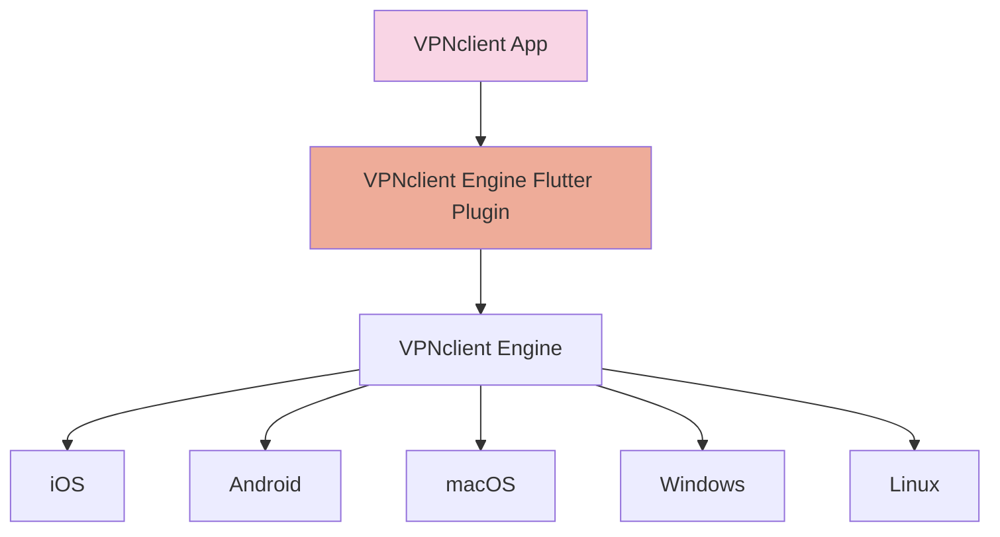

# 🚀 VPN Client Engine Flutter

## 🌍 Overview

VPN Client Engine Flutter is a Flutter Plugin for managing VPN connections with an intuitive API. It provides seamless integration with various platforms, allowing developers to control VPN connections efficiently.


## 🏗️ Architecture Overview



### ✅ Supported Platforms
- iOS 15+ (iPhone, iPad, MacOS M)
- Android
- 🏗️ MacOS Intel
- 🏗️ Windows
- 🏗️ Ubuntu

## 📥 Getting Started

To start using VPN Client Engine Flutter, ensure you have Flutter installed and set up your project accordingly.

### 📦 Installation
```sh
flutter pub add vpnclient_engine_flutter
```

## 📌 Example Usage

```dart
  // Initialize the Engine
  VPNclientEngine.initialize();

  // Clear subscriptions
  VPNclientEngine.ClearSubscriptions();

  // Add subscription
  VPNclientEngine.addSubscription(subscriptionURL: "https://pastebin.com/raw/ZCYiJ98W");
  //VPNclientEngine.addSubscriptions(subscriptionURLs: ["https://pastebin.com/raw/ZCYiJ98W"]);

  // Update subscription
  await VPNclientEngine.updateSubscription(subscriptionIndex: 0);

  // Listen for connection status changes
  VPNclientEngine.onConnectionStatusChanged.listen((status) {
    print("Connection status: $status");
  });

  //Connect to server 1
  await VPNclientEngine.connect(subscriptionIndex: 0, serverIndex: 1);

  // Set routing rules
  VPNclientEngine.setRoutingRules(
    rules: [
      RoutingRule(appName: "YouTube", action: "proxy"),
      RoutingRule(appName: "google.com", action: "direct"),
      RoutingRule(domain: "ads.com", action: "block"),
    ],
  );

  // Ping a server
  VPNclientEngine.pingServer(subscriptionIndex: 0, index: 1);

  VPNclientEngine.onPingResult.listen((result) {
    print("Ping result: ${result.latencyInMs} ms");
  });

  await Future.delayed(Duration(seconds: 10));

  //Disconnect
  await VPNclientEngine.disconnect();
```

---

## ⚙️ API Methods

### 🔹 1. initialize()
Initializes the VPN Client Engine. This should be called before using any other method.

### 🔹 2. connect({required int subscriptionIndex,required int serverIndex})
Connects to the specified VPN server.
- `index`: Index of the server from `getServerList()`.s

### 🔹 3. disconnect()
Disconnects the active VPN connection.

### 🔹 4. getConnectionStatus()
Returns the current connection status (`connected`, `disconnected`, `connecting`, `error`).

### 🔹 5. getServerList()
Fetches the list of available VPN servers.

### 🔹 6. pingServer({required int index})
Pings a specific server to check latency.
- `index`: Index of the server from `getServerList()`.
- Returns: Latency in milliseconds.

### 🔹 7. setRoutingRules({required List<RoutingRule> rules})
Configures routing rules for apps or domains.
- `rules`: List of routing rules (e.g., route YouTube traffic through VPN, block ads.com).

### 🔹 8. loadSubscriptions({required List<String> subscriptionLinks})
Loads VPN subscriptions from the provided list of links.
- `subscriptionLinks`:  A list of subscription file URLs.

### 🔹 9. getSessionStatistics()
Returns statistics for the current VPN session (e.g., data usage, session duration).

### 🔹 10. setAutoConnect({required bool enable})
Enables or disables auto-connect functionality.
- `enable`: `true` to enable, `false` to disable.

### 🔹 11. setKillSwitch({required bool enable})
Enables or disables the kill switch.
- `enable`: `true` to enable, `false` to disable.

---

## 🔔 Events

### 📡 1. onConnectionStatusChanged
Triggered when VPN connection status changes.
- Payload: `ConnectionStatus` (e.g., `connected`, `disconnected`, `error`).

### ⚠️ 2. onError
Triggered when an error occurs.
- Payload: `ErrorCode` and `ErrorMessage`.

### 🔄 3. onServerSwitched
Triggered when the VPN server is switched.
- Payload: `newServerAddress`.

### 📊 4. onPingResult
Triggered when a ping operation completes.
- Payload: `serverIndex` and `latencyInMs`.

### 🔑 5. onSubscriptionLoaded
Triggered when a subscription is loaded successfully.
- Payload: `subscriptionDetails`.

### 📈 6. onDataUsageUpdated
Triggered periodically with updated data usage statistics.
- Payload: `dataUsed` and `dataRemaining`.

### 📌 7. onRoutingRulesApplied
Triggered when routing rules are applied.
- Payload: `List<RoutingRule>`.

### 🚨 8. onKillSwitchTriggered
Triggered when the kill switch is activated.

---

## 📂 Data Models

### 🔹 1. ConnectionStatus
Enum: `connecting`, `connected`, `disconnected`, `error`.

### 🔹 2. Server
- `address`
- `latency`
- `location`
- `isPreferred`

### 🔹 3. RoutingRule
- `appName`
- `domain`
- `action` (`block`, `allow`, `routeThroughVPN`).

### 🔹 4. ProxyConfig
- `type` (`socks5`, `http`)
- `address`
- `port`
- `credentials`

### 🔹 5. ErrorCode
Enum: `invalidCredentials`, `serverUnavailable`, `subscriptionExpired`, `unknownError`.

### 🔹 6. SubscriptionDetails
- `expiryDate`
- `dataLimit`
- `usedData`

---

## 🤝 Contributing
We welcome contributions! Please fork the repository and submit pull requests.

## 📜 License

This project is licensed under the **VPNclient Extended GNU General Public License v3 (GPL v3)**. See [LICENSE.md](LICENSE.md) for details.

⚠️ **Note:** By using this software, you agree to comply with additional conditions outlined in the [VPNсlient Extended GNU General Public License v3 (GPL v3)](LICENSE.md)

## 💬 Support
For issues or questions, please open an issue on our GitHub repository.

